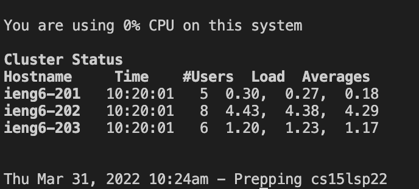
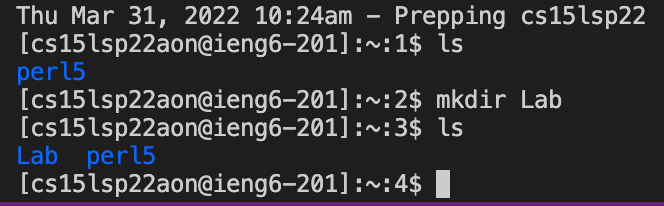
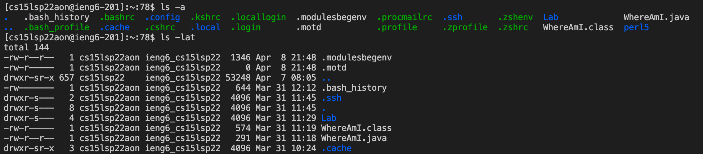
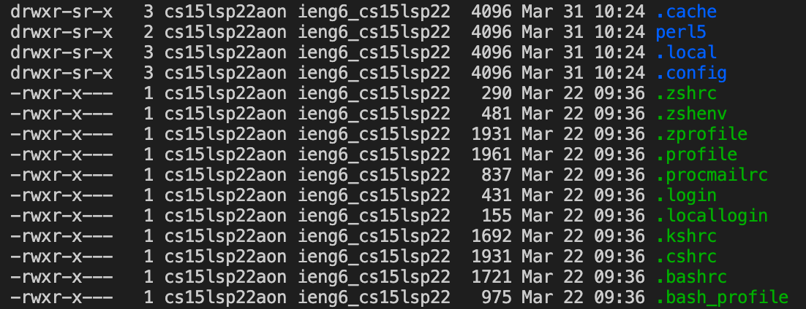
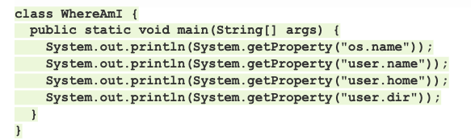
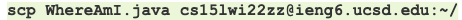
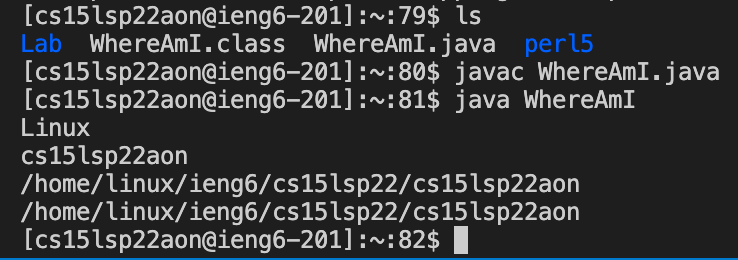
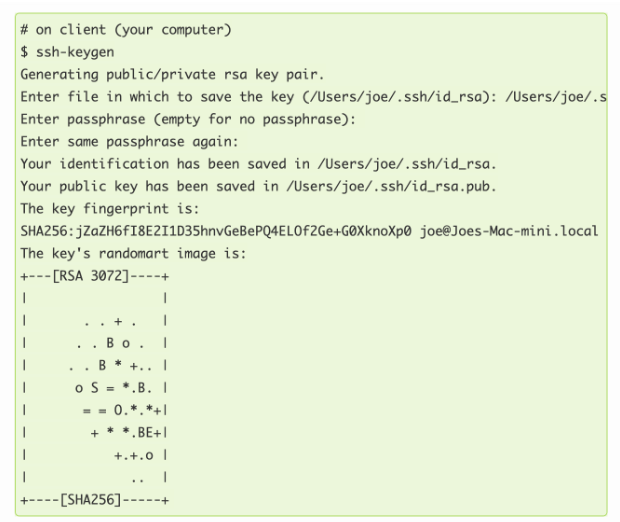
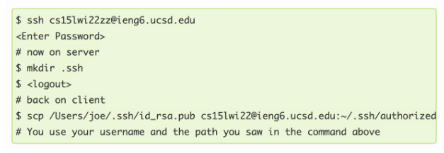
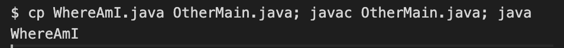

# **Logging Into a Course-Specific Account on ieng6 Server**

The bullet points below indicate topics that will be covered in properly setting up an account on an ieng6 server
## Installing VSCode

1. Click the link to download [VSCode](https://code.visualstudio.com/)

When VSCode is downloaded successfully, a screen like the image below should popup

You are allowed to use any other IDE's, however, VSCode is probably the easiest and best IDE to use.
## Remotely Connecting

Before connecting to the server, you will need a username.

You can find your own personal username for CSE15L from the link below:

[Course-Specific Username](https://sdacs.ucsd.edu/~icc/index.php)

Open VSCode, and open a new Terminal(Ctrl or Command + `, or use the Terminal → New Terminal menu option)

When the Terminal opened up, there should be a '$' after your directory

Writing the command to connect to the ssh server

Replace the zz with your own course-specific username. It should be 3 letters, for example cs15lwi22abc. Once, you click enter, it will prompt you to enter a password. This password is the same password that you use to log in to Canvas or mytritonlink.

When you logged in successfully, it will show you a cluster status such as the image below.

Once you have this on your terminal, you have successfully connect to the ieng6 server. The next steps will be running some basic command lines inside the server by using the terminal.
## Basic Command Lines

Some basic command lines:

1. cd = change directory
2. ls = list directory
3. pwd = prints working directory
4. mkdir = make directory
5. cp = copy
6. rm = remove directory
7. cat = reads whatever is inside the directory or file

Again, these are just some basic command lines that are used everyday by programmers.

There are other command lines that are more advanced and I will list some below
1. cd ~ = open the home directory
2. ls -a = list all deeper directories
3. ls -lat = list the deeper directories, and regular directories as well as when it was it created

Below is an example of running the basic command line on the server including the more sophisticated ones.

As you can see, I used ls to list the directories in the home directories, but there's only perl5 so I created a direcotry called "Lab" by using the mkdir command line. Now, when I used ls again, it showed both Lab and perl5.

## Moving Files with scp

For this part of the tutorials, we need to understand what scp means. Scp is a copy command line that allows you to copy or move a file to another server.

To understand how to move file with scp, let's begin by creating a file on *your* computer called WhereAmI.java and put the following contents into it:

Then, in the terminal from the directory where you made the file, run the command below (make sure to use your unique username and replace wi22 with sp22)

Then, log into ieng6 with ssh, and use the ls command. You should see the file in the home directory, if successfully copied into the ieng6 server. If you are successfull, then you should be able to run the file on the ieng6 computer using javac and java.

## Setting an ssh key

An ssh key will allow us to log in or run scp at a much faster pace, without having to input our password every time. Behind this solution is a program called ssh-keygends, which creates a pair of files called the *public key* and *private key*. The public key will be copied to a specific location on the server, and the private key on the client's computer. Then, the ssh command will use the pair of files from both location instead of the password. 

Follow the steps in the image below to successfully create the keys and copying the public key to the server

When the keys are created and paired successfully, when logging into the ieng6 server, they will not prompt you to enter your password, rather it will connect automatically.

## Optimizing Remote Running

As a programmer, in the future, we will do lots of copying files from our own laptop or computer to a remote server and running it. There are some hints that could fasten this process:

1. Write a command in quotes at the end of an ssh command to directly run it on the remote server
2. Use semicolons to run multiple commands on the same line in most terminals
3. Use the up-arrow on your keyboard to recalled the last command that was run
$ cp WhereAmI.java OtherMain.java; javac OtherMain.java; java WhereAmI

