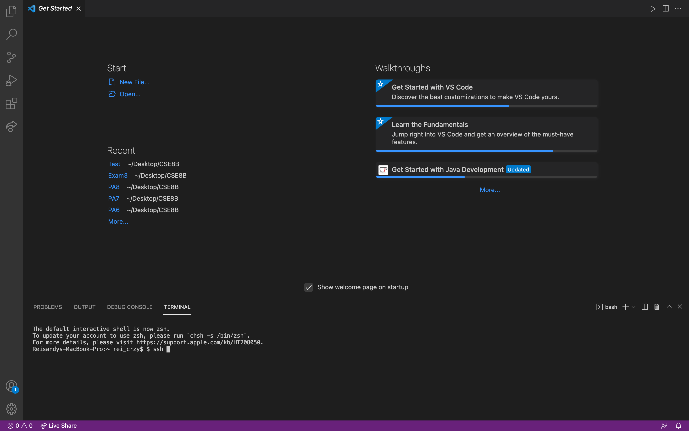
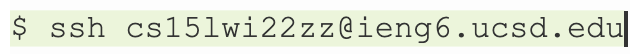

**Logging Into a Course-Specific Account on ieng6 Server**

Below are topics that will be covered in properly setting up on an ieng6 server
* Installing VSCode

1. Click the link to download [VSCode](https://code.visualstudio.com/)

When VSCode is downloaded successfully, a screen like the image below should popup

You are allowed to use any other IDE's, however, VSCode is probably the easiest and best IDE to use.
* Remotely Connecting

Before connecting to the server, you will need a username.

You can find your own personal username for CSE15L from the link below:

[Course-Specific Username](https://sdacs.ucsd.edu/~icc/index.php)

Open VSCode, and open a new Terminal(Ctrl or Command + `, or use the Terminal → New Terminal menu option)

When the Terminal opened up, there should be a '$' after your directory

Writing the command to connect to the ssh server

Replace the zz with your own course-specific username. It should be 3 letters, for example cs15lwi22abc. Once, you click enter, it will prompt you to enter a password. This password is the same password that you use to log in to Canvas or mytritonlink.
* Basic Command Lines
* Moving Files with scp
* Setting an ssh key
* Optimizing Remote Running