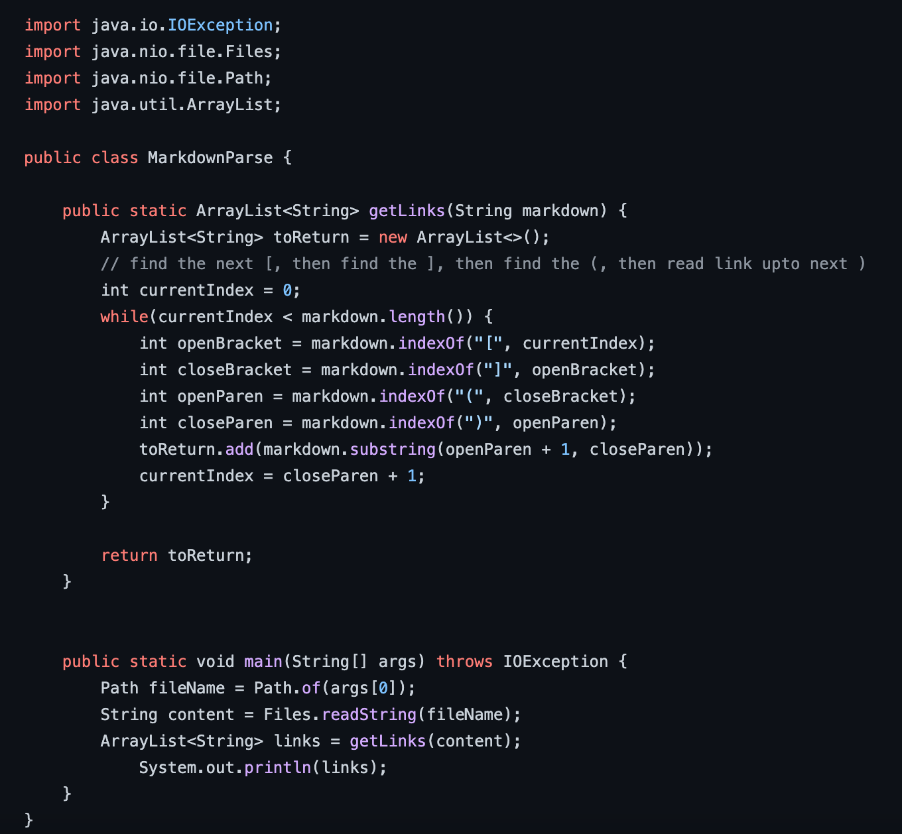
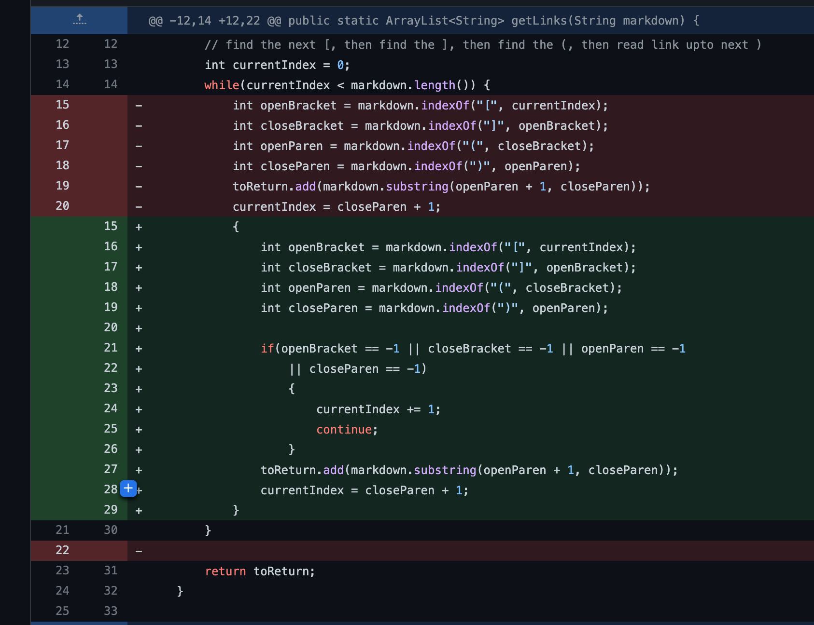
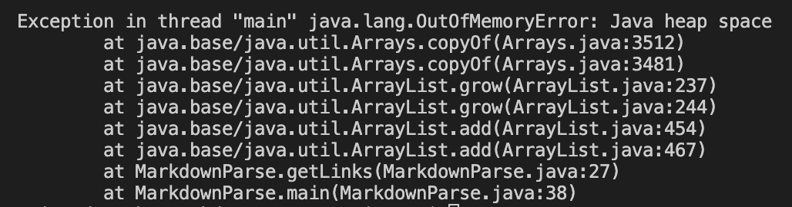
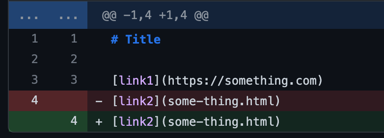
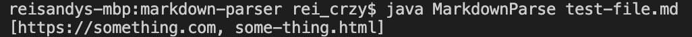
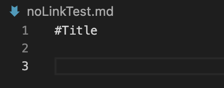
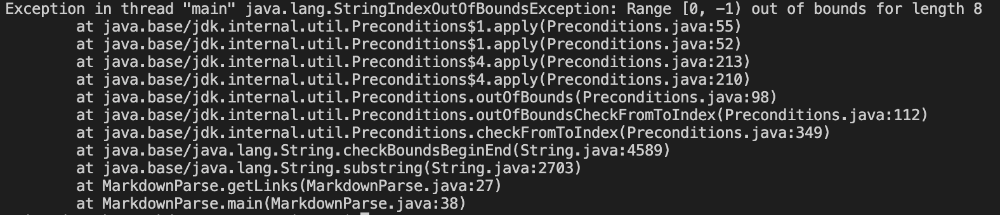
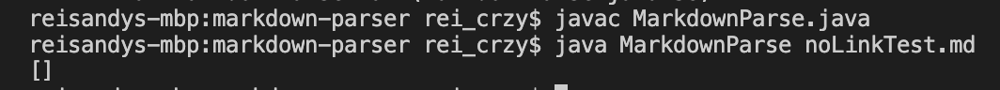
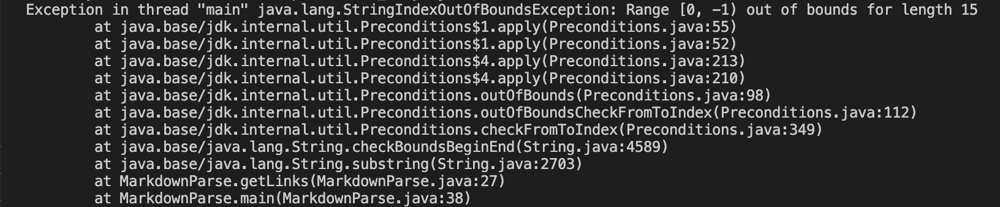
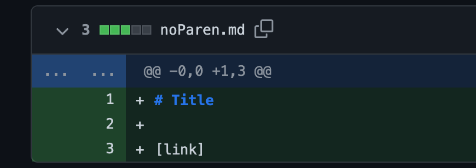

# **Fork/Debugging**

## First Code Change (Bug From Class)
The first bug that my partner and I encountered is from the `MarkdownParse.java` file which we had to fork from this link ([Fork](https://github.com/nidhidhamnani/markdown-parser)).

The code that was contained in the `MarkdownParse.java` is shown below

In the `test-file.md` file, the codes were:

`# Title`

`[link1](https://something.com)`

`[link2](some-thing.html)`

There were no errors when running this test because there were no new line after the link2 line. However, it produced an error of `java.lang.OutOfMemoryError: java heap space` when we added a new line at the end.

To fix this, we had to check the conditions when `openBracket`, `closeBracket`, `openParen`, or `closeParen` becomes -1. 

This is the link to the test file for a [failure-inducing input](https://github.com/reisandylamdjani/markdown-parser/blob/main/test-file.md).

The images below will show the symptom of the failure-inducing input and the code change diff from GitHub

The problem of the code is that the owner forgot to check if `indexOf()` cannot locate the index of the specificied string. Based on the function, it will return the index within the string of the first occurrence and if no such value exists, then it will return -1. In our test case, since the new line did not have any `[] or ()` then it will always return -1 that becomes an infinite loop that takes up the memory in the heap and causing it to crash because of no more memories. 

The correct output is shown below:

## Second Code Change (No links)
For this bug, we needed to consider the output of the file if we had no links. For us, this means that there is nothing written in the test file because if we put only ``, the output would produce `[]`, an empty array which is the correct output.

In our `noLinkTest.md`, we only wrote `#Title` and 2 new lines.

Our solution was the same as the solution to the first bug, we had to check the condition when `openBracket`, `closeBracket`, `openParen`, or `closeParen` becomes -1. 

Link to the failure-inducing input for [no codes](https://github.com/reisandylamdjani/markdown-parser/blob/main/noLinkTest.md).

For no codes, the symptom is:

The problem with this bug is that it doens't know when to return that index after that specified string. The first bug was different because they had contents to start, but this bug does not which throws a StringIndexOutOfBoundsException because in a sense is "out-of-bounds" or out of range. 

The correct output is shown below

## Third Code Change (Uses Brackets but No Parentheses)
For this bug, I considered the test file where there are `[]` but `()`.

In our `noParen.md` file, we only put:

`# Title`

`[link]`

Again, our solution to this bug is the same as the first and second bug listed above. We had to check the condition when `openBracket`, `closeBracket`, `openParen`, or `closeParen` becomes -1. 

Link to the failure-inducing input for [noParen](https://github.com/reisandylamdjani/markdown-parser/blob/main/noParen.md).

For no parentheses, the symptom is:

The relationship between the bug, the failure-inducing input, and the symptom is related to the second bug where it found the brackets, but cannot find the parentheses because you need both brackets and parentheses to return the content of the strings, even if there is nothing inside. It first found the brackets, both open and closed, then it needs to find the open parenthese, but there are none, hence, indexOf() will return -1 which is out an out of bounds for the string index. 

