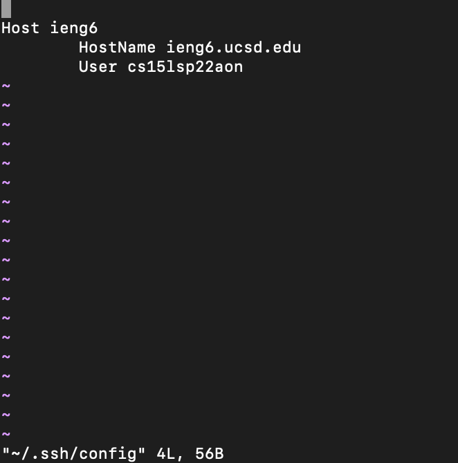
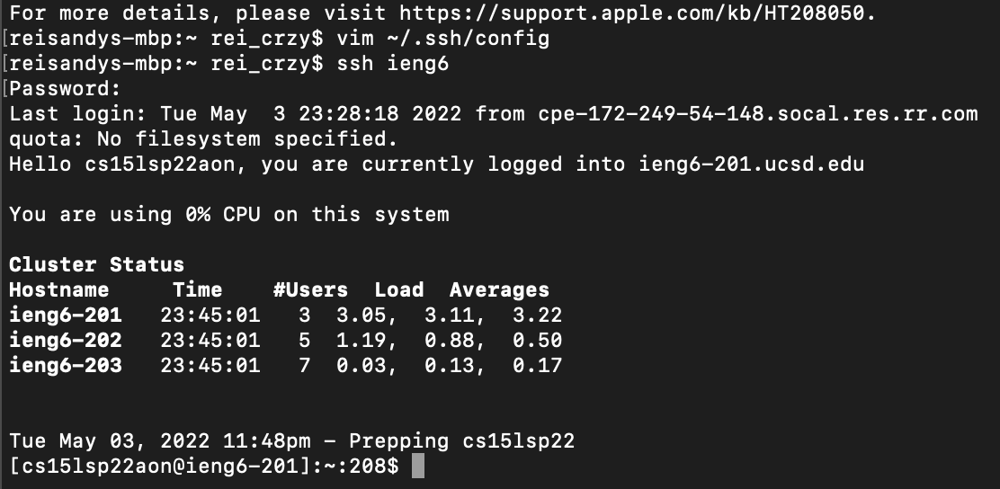
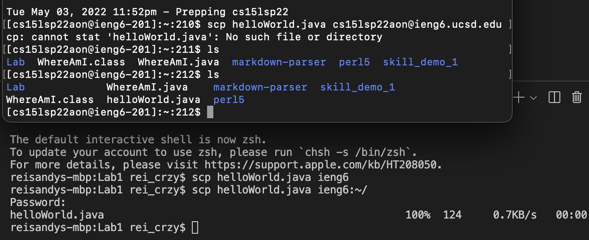
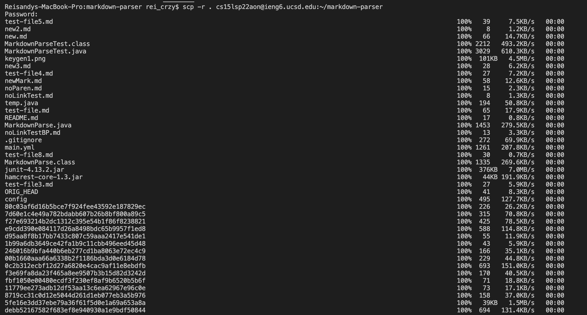

# **Lab Report 3**
# Streamlining ssh Configuration
For this part of the assignment, I have to open the config files using any text editor. In my case, I used vim to edit the file. Below is an image of the finished file after adding the Host and alias.

I used the alias `ieng6` for my example.

Once I have edited and saved my config file. I ran the `ssh` command using the `ieng6`. The image below will give an example of that.

From this, I just have to create a new file on my computer so that I can copy it using the `scp` command to my account using the alias `ieng6`. Below is an example of what the correct output would be if everything is done correctly.

Based on the image above, you can see that the `helloWorld.java` file wasn't listed in the home directory yet, but once I copied it into the account, it showed up.

# Setup Github Acces from ieng6

# Copy Whole Directories with `scp -r`
The first image that I will show is when I copied the whole markdown-parser directory to my `ieng6` account.

