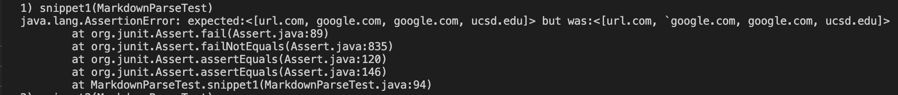

# **Lab Report 4**
Before we get started on Lab Report 4, I will give the link to my `markdown-parse` repository and a link to the repository that I reviewed last week.

[my markdown-repository](https://github.com/reisandylamdjani/markdown-parser)

[the other repository](https://github.com/Miyuki-L/markdown-parser)

## Snippet 1

The expected output of the snippet:

The test on my `MarkdownParseTest.java`:

The test failed for this snippet because it ignored the backtick inside the String content. Some code changes that can be made into my program is specifying a character that shouldn't be inside the String content. For example, in this context, it would be the backtick. Having a `currentIndex` variable that tracks all the characeters inside the String content to make sure that there are no characters with a backtick.

The test on the other repository:

The test failed using the code from the other repository:

The test failed as it did not ignore the backtick in the String content.

## Snippet 2

The expected output of the snippet:

The test on my `MarkdownParseTest.java`:

The test for this failed because the code in `MarkdownParse.java` did not read the two closed parentheses after `a.com`.

Some code changes that can be made are if there are any open or close brackets and parentheses inside the String content, it should be discarded. There should be a variable called `currentIndex` where it goes inside the String content and checks each index to make sure that there are no parentheses, close or open, and no brackets, close or open.

The test on the other repository:

The test also failed on this code because it ignored the open parentheses that were inside the String content.

## Snippet 3

The expected output of the snippet:

The test on my `MarkdownParseTest.java`:

The test for this failed because the code in `MarkdownParse.java` because it ignored the white spaces and new line. 

Some code changes that can be made into my program is almost the same procedure as Snippet 2 where it has `currentIndex` be inside the String content to make sure that if there are any white spaces or new line, it will be ignored.

The test on the other repository:

The test also failed on this because it ignored the white spaces and new line that were inside the String content.

 