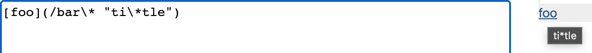
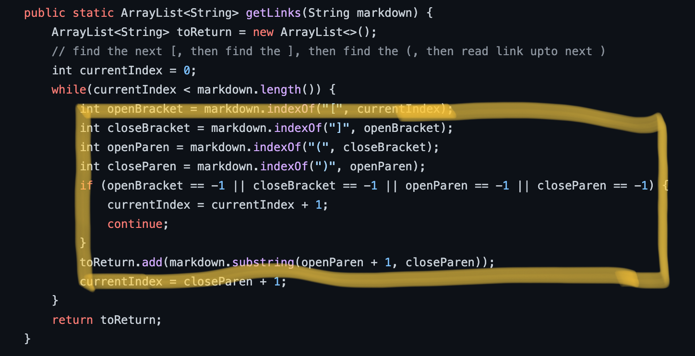
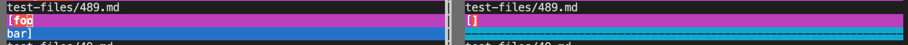
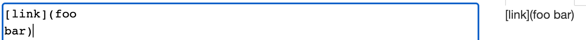

# **Lab Report 5**
## First Test File (22.md)
I found out the results or output is different by using `vimdiff`. A screenshot will be provided below.

[22.mdLink](https://github.com/nidhidhamnani/markdown-parser/blob/main/test-files/22.md)

Both implementations in `my-markdown-parser` and `markdown-parse` is incorrect. Based on the screenshot above, the expected output is supposed to be `ti*tle` but based on the `vimdiff` comparison, the implementation in the `markdown-parse` shows no output, and the implemenation in the `my-markdown-parser` shows the whole value inside the parentheses.

The bug in this situation is the fact that the implementation inside the `my-markdown-parser` file will return an empty string if any of the brackets and parentheses. It does not take into acccount of any weird characters such as `/` or `\` or `*`. Since the parentheses has the `""` symbol for a `string`, the expected output should be `ti*tle` since it is inside the `string` statement but it's not printing anything.

Inside the `getLinks` method, there should be should be a helper method where if any of the brackets or parentheses are -1, it should change the index of that back to whatever and move on. Meaning, it ignores wrong inputs and still outputs the correct output.

## Second Test File (489.md)
I found out the results or output is different by using `vimdiff`. A screenshot will be provided below.

[489.mdLink](https://github.com/nidhidhamnani/markdown-parser/blob/main/test-files/489.md)

Both implementations in `my-markdown-parser` and `markdown-parse` is incorrect. Based on the screenshot above, the expected output is supposed to be the word "foobar" in a link format, but because there was a new line after foo, the implementations in `my-markdown-parser` and `markdown-parse` could not turn it into a link.

The bug in this situation is the fact that the code throws a value of `-1` when the new line is between `foo` and `bar`. The code starts off reading the open parenthese as well as taking into accounts of the index and tries to find the closing parenthese, but there was a new line that was implemented in the test, therefore, it throws a value of `-1`.

Much like the same approach for the first file, inside the `getLinks` method, there should be a helper method which refreshes the index back to non `-1` and move on with the input, ignoring all characters. In this case, one helpful code would be to indicate if there is `""` inside the parentheses. If there is those symbols, then just output anything inside the two quotation marks. 